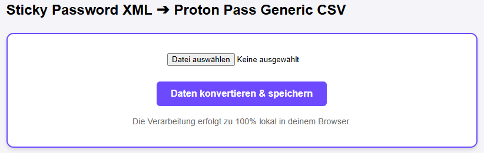

# Sticky Password to Proton Pass Converter

A simple, secure, and client-side web tool to convert **Sticky Password XML** exports into **Proton Pass compatible CSV** files.

## 🚀 Why this tool?

Sticky Password uses a unique XML structure where website information (`<Account>`) and credentials (`<Login>`) are stored separately and linked via IDs. Most password managers cannot parse this relational format natively. This tool:
- Maps `Accounts` to their corresponding `Logins`.
- Merges the data into a flat CSV structure.
- Prepares the data specifically for the **Proton Pass "Generic CSV"** import.

## 🔒 Security First

- **Zero Server Interaction:** This tool is built with pure JavaScript. All processing happens locally in your browser.
- **No Data Collection:** Your sensitive password data never leaves your computer.
- **Privacy:** You can even run this tool offline by saving the `index.html` file to your local machine.

## 🛠️ How to use

1. **Export from Sticky Password:**
   - Open Sticky Password on Windows.
   - Go to `Menu` -> `Export`.
   - Choose `Export all` and select **Unencrypted XML**.
2. **Convert:**
   - Open index.html
   - Select your `.xml` file.
   - Click **"Convert & Save"**.
3. **Import to Proton Pass:**
   - Open Proton Pass (Web or Browser Extension).
   - Go to `Settings` -> `Import`.
   - Choose **Generic CSV**.
   - Upload the `sticky_to_proton.csv` file generated by this tool.

> [!CAUTION]
> **Important:** Always delete the unencrypted XML and the converted CSV file permanently after a successful import.

## 📂 Repository Structure

- `index.html`: The core logic and UI in a single file for easy portability.

# Sticky Password to Proton Pass Converter

**Try it here:** [https://DanielRosso.github.io/sticky-password-xml-to-proton-pass-converter/](https://DanielRosso.github.io/sticky-password-xml-to-proton-pass-converter/)

## Preview

*The interface is kept minimal and focused on security.*

---
## ⚖️ License

Distributed under the MIT License. See `LICENSE` for more information.