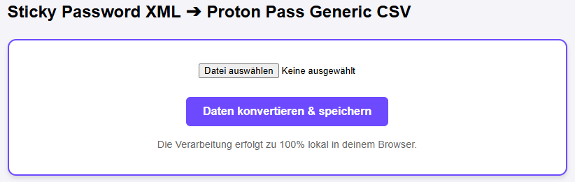

  <h1>🔐 Sticky Password zu Proton Pass Konverter</h1>
  
Ein sicheres, rein clientseitiges Web-Tool zur Konvertierung relationaler Sticky Password XML-Exporte in ein Proton Pass kompatibles CSV-Format.

  

    
    
    
  

  

    
  

---

## 📌 Projektübersicht & Problemlösung

Dieses Tool löst ein sehr spezifisches Datenmigrations-Problem:
**Sticky Password** nutzt eine verschachtelte XML-Struktur, in der Webseiten (`<Account>`) und Zugangsdaten (`<Login>`) getrennt gespeichert und über IDs relational verknüpft sind. Moderne Passwort-Manager wie Proton Pass können dieses Format beim Import nicht nativ verarbeiten. 

Dieses Skript mappt die Accounts zu den entsprechenden Logins, flacht die relationale Datenstruktur ab und generiert eine saubere CSV-Datei, die exakt auf die Spezifikationen von **Proton Pass** ("Generic CSV") zugeschnitten ist.

## 🛡️ Security First (Architektur-Ansatz)

Beim Umgang mit unverschlüsselten Passwörtern ist Sicherheit das absolute oberste Gebot. Daher ist dieses Projekt architektonisch extrem minimalistisch und restriktiv aufgebaut:

- **100% Clientseitige Verarbeitung:** Es gibt kein Backend. Die gesamte XML-Verarbeitung und CSV-Generierung geschieht im RAM des Browsers über reines Vanilla JavaScript.
- **Zero Data Collection:** Sensible Daten verlassen niemals das Endgerät. Es gibt keine Analytics, keine externen CDN-Aufrufe (außer Standard-Fonts) und keine Server-Requests.
- **Offline-Fähigkeit:** Das komplette Tool besteht aus einer einzigen `index.html`. Es kann (und sollte) heruntergeladen und komplett offline im Browser ausgeführt werden, um maximale Sicherheit zu garantieren.

## 🛠️ Verwendung

1. **Export aus Sticky Password:**
   - Sticky Password öffnen -> `Menü` -> `Exportieren`
   - Alle Passwörter als **unverschlüsselte XML** exportieren.
2. **Konvertieren:**
   - Die [Live-Demo](https://DanielRosso.github.io/sticky-password-xml-to-proton-pass-converter/) öffnen (oder `index.html` lokal starten).
   - Die `.xml` Datei auswählen und auf **"Convert & Save"** klicken.
3. **Import in Proton Pass:**
   - In Proton Pass zu den Einstellungen -> `Import` navigieren.
   - **Generic CSV** auswählen und die neu generierte `sticky_to_proton.csv` hochladen.

> ⚠️ **Wichtiger Sicherheitshinweis:** Lösche sowohl die XML- als auch die generierte CSV-Datei sofort und dauerhaft (Papierkorb leeren!), nachdem der Import in Proton Pass erfolgreich war.

## 📸 Vorschau

## 📄 Lizenz
Dieses Projekt steht unter der [MIT-Lizenz](./LICENSE).
